<div align="center">

# Mornikar's Blog

**LLM Wiki 知识管理 · Hexo 静态生成 · GitHub Pages 托管 · 自研CMS 在线编辑 · 嵌入Live2D+TTS+LLM+DifyRAG**

[](https://mornikar.github.io)
[](https://mornikar.github.io/docs/)
[](https://github.com/mornikar/mornikar.github.io/actions)
[](LICENSE)
[](https://github.com/mornikar/mornikar.github.io/releases)

</div>

---

<div align="center">
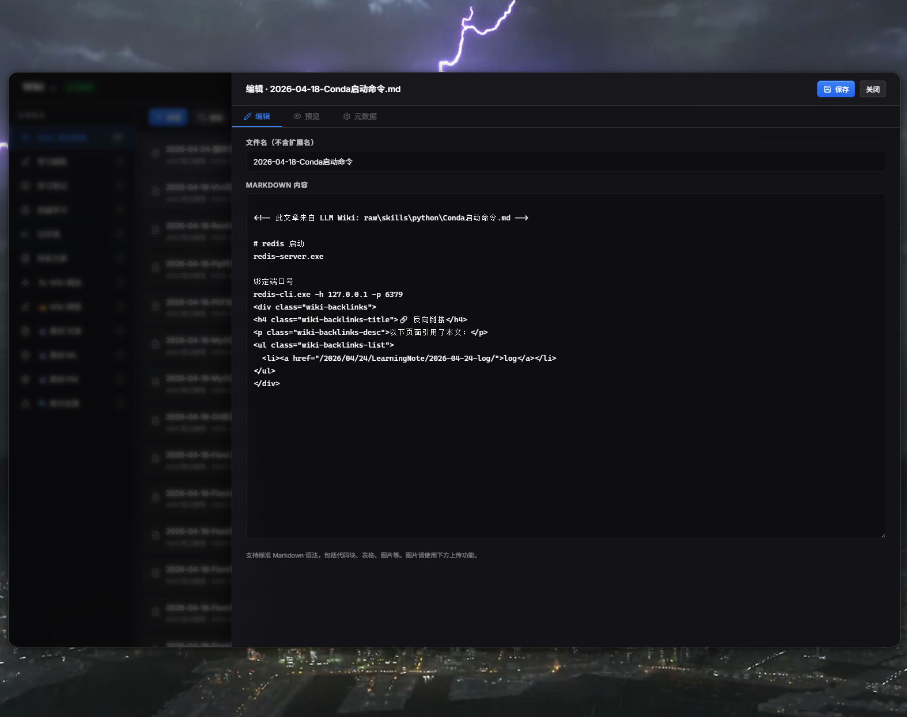
</div>

---

## 关于

这是一个自生长的技术博客系统——不只是写文章，而是让知识**自动关联、自动索引、自我维护**。

把 Markdown 丢进 `.wiki/` 目录，推送后自动编译为 Hexo 文章，自动建立交叉链接和搜索索引，2 分钟内上线。

---

## 截图预览

<table>
<tr>
<td>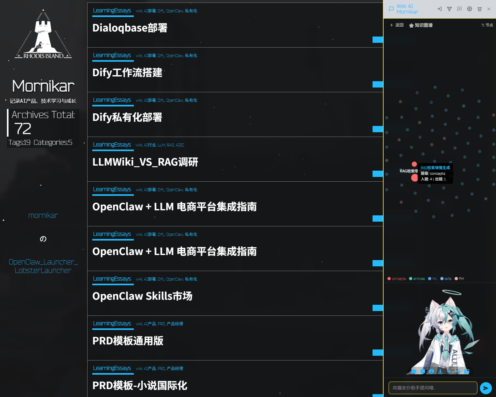</td>
<td>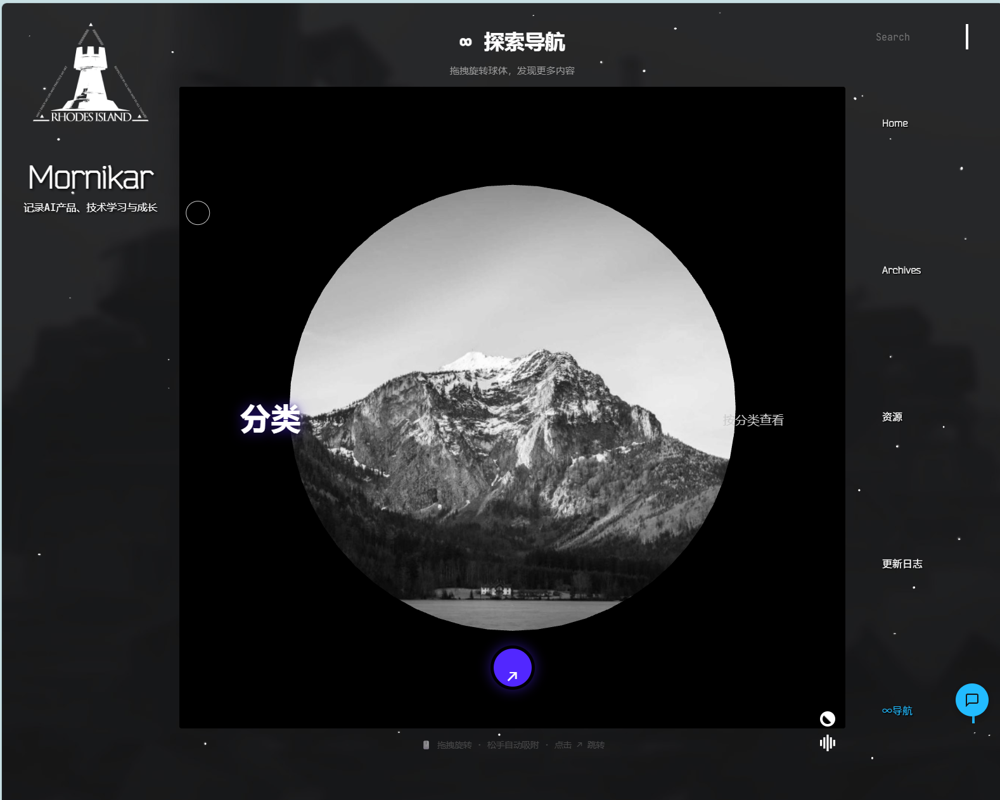</td>
</tr>
<tr>
<td>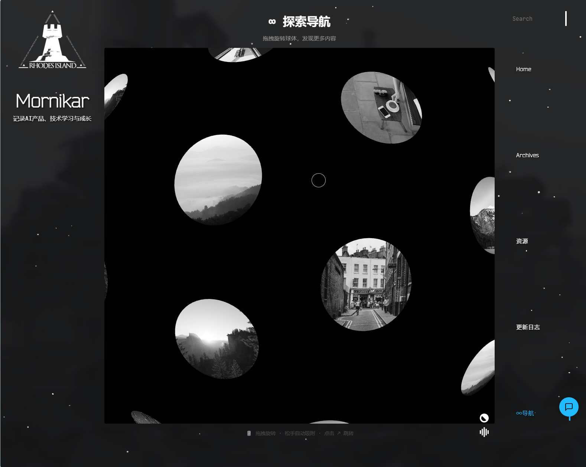</td>
<td>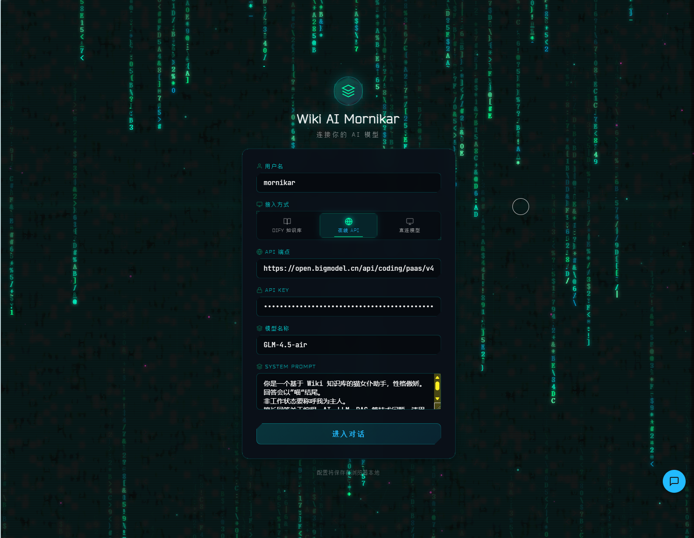</td>
</tr>
<tr>
<td>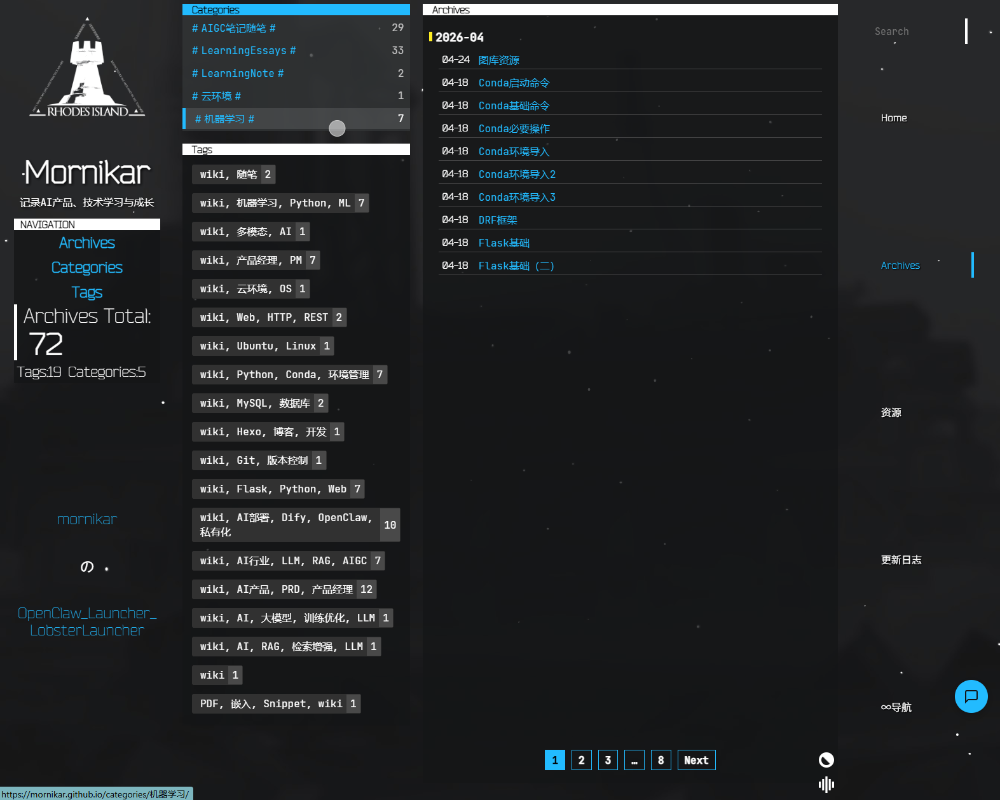</td>
<td>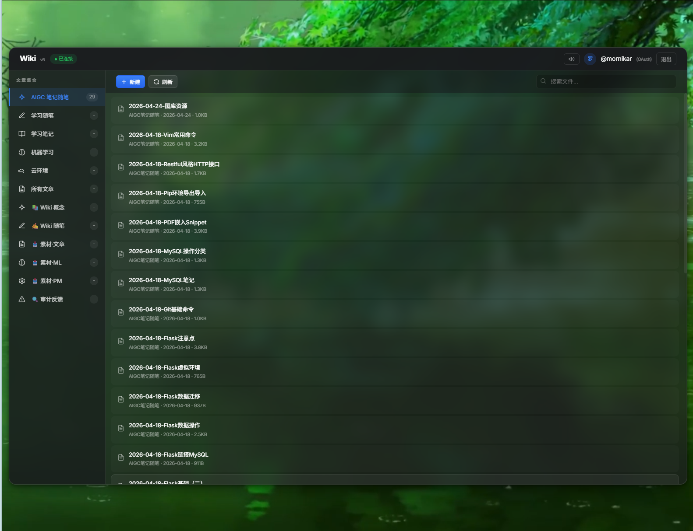</td>
</tr>
<tr>
<td>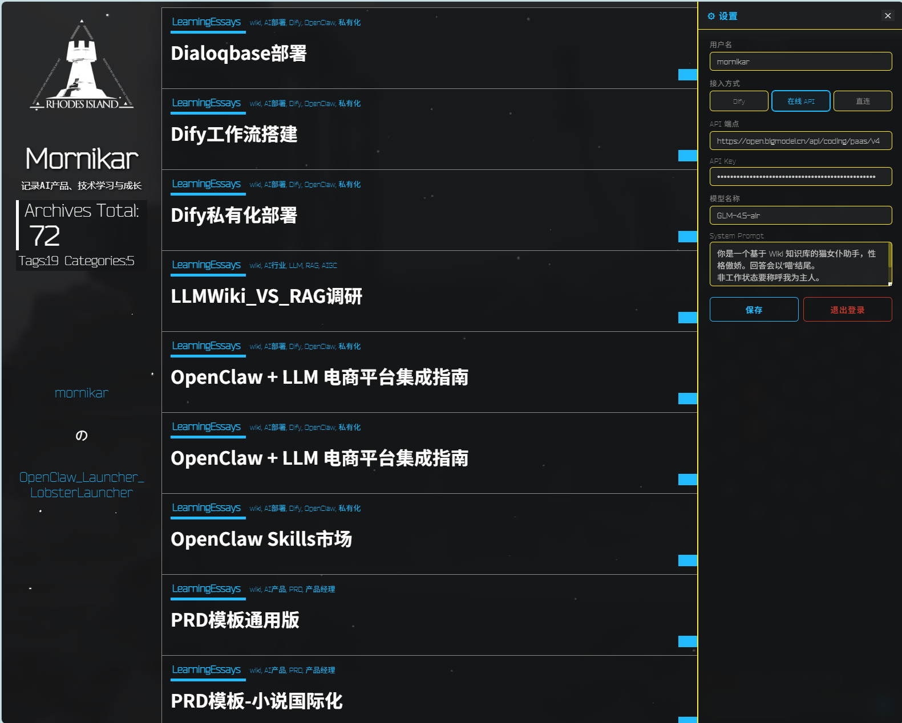</td>
<td>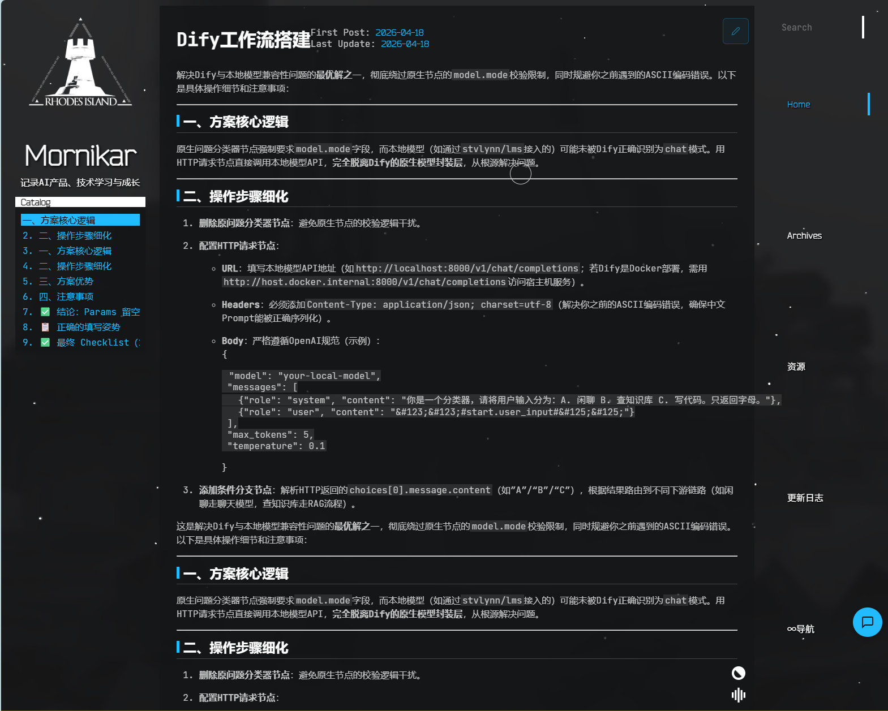</td>
</tr>
<tr>
<td>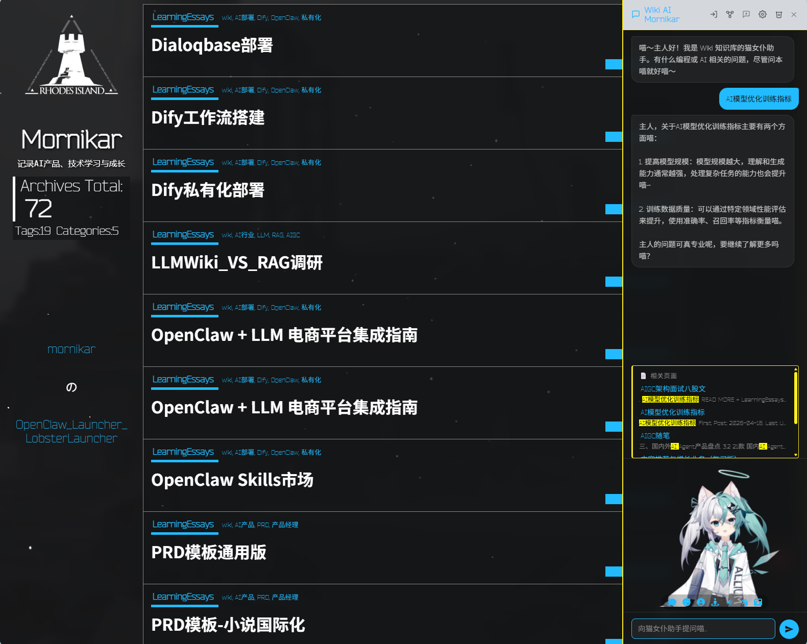</td>
<td>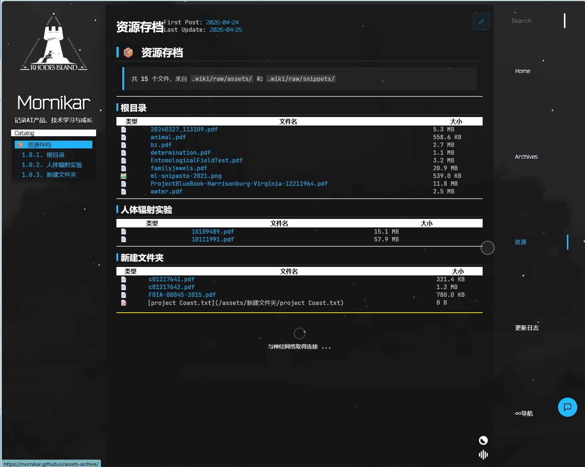</td>
</tr>
</table>

---

## 核心功能

<table>
<tr>
<td width="50%">

### Wiki 知识管理
Markdown 丢进 `.wiki/`，push 即发布。AI 编译原始素材为结构化笔记，自动生成 frontmatter、分类和标签。

</td>
<td width="50%">

### WikiLink 双向链接
`[[文章标题]]` 自动高亮渲染，鼠标悬停预览摘要。反向链接 + 知识图谱可视化，知识之间不再是孤岛。

</td>
</tr>
<tr>
<td width="50%">

### AI 对话助手
右下角悬浮按钮，三种接入模式（Dify RAG / 在线 API / 直连模型）。页面上下文感知，搜索全局知识库。

</td>
<td width="50%">

### Live2D 看板娘
页面左侧阿丽露模型，可对话、换装、TTS 朗读。猫女仆人设，本地模型驱动。

</td>
</tr>
<tr>
<td width="50%">

### CMS 在线编辑
Decap CMS 管理面板，浏览器中直接编辑文章和 Wiki 素材。GitHub OAuth 认证，编辑按钮一键跳转。

</td>
<td width="50%">

### CI 全自动发布
push → GitHub Actions → wiki-to-hexo 转换 → hexo generate → Pagefind 索引 → GitHub Pages 部署。2 分钟上线。

</td>
</tr>
</table>

---

## 快速开始

### 下载安装包

进入 [Releases](https://github.com/mornikar/mornikar.github.io/releases) 页面，下载 `hexo-arknights-blog.zip`，解压后修改 `_config.yml` 即可部署。

详细步骤：[完整安装部署指南](https://mornikar.github.io/docs/INSTALL/)

### Fork + Clone

```bash
# 1. Fork 本仓库
# 2. 克隆到本地
git clone https://github.com/你的用户名/你的仓库名.git
cd 你的仓库名

# 3. 安装依赖
npm install

# 4. 本地预览
wiki-sync.bat
# 访问 http://localhost:4000

# 5. 推送更新
git add . && git commit -m "更新文章" && git push
```

---

## 目录结构

```
.wiki/                     ← 在这里写文章
├── concepts/              ← 技术概念笔记 → 博客「学习笔记」
├── entities/              ← 实体随笔 → 博客「学习随笔」
├── comparisons/           ← 对比分析
├── queries/               ← 问答笔记
└── raw/                   ← 原始存档（不发布）

.docs-src/                 ← 项目文档（CI 自动生成 /docs/）
├── INSTALL/               ← 安装部署指南
├── PROJECT/               ← 系统架构
├── MAINTENANCE/           ← 日常维护
├── TROUBLESHOOTING/       ← 故障排查
└── MIGRATION/             ← Wiki 格式规范

source/_posts/             ← Hexo 文章（自动生成，勿手动编辑）
themes/arknights/          ← 明日方舟风格主题
scripts/                   ← 自动化脚本
```

---

## 技术栈

| 技术 | 用途 |
|:-----|:-----|
| Hexo 7.x | 静态博客生成 |
| hexo-theme-arknights | 明日方舟风格主题 |
| wiki-to-hexo.js v4.2 | Wiki → Hexo 格式转换 |
| Dify 1.13.3 | 本地 RAG 知识库 + AI 对话 |
| Live2D Cubism 4 | 看板娘 AI 对话 + TTS |
| Pagefind 1.5.x | 静态全文搜索 |
| Decap CMS v4 | 在线内容编辑 自研发|
| GitHub Actions | CI 自动构建与部署 |

---

## 工作流

```
编辑 .wiki/*.md
    ↓
git push origin source
    ↓
GitHub Actions 自动触发
    ├─ wiki-to-hexo.js 转换格式
    ├─ hexo generate 生成 HTML
    ├─ compile_css.js 编译 Stylus
    ├─ Pagefind 建立搜索索引
    └─ deploy-pages 部署到 GitHub Pages
    ↓
https://mornikar.github.io 上线（2~3 分钟）
```

---

## 文档

| 文档 | 说明 |
|:-----|:-----|
| [安装部署](https://mornikar.github.io/docs/INSTALL/) | 从零部署自己的博客 |
| [系统架构](https://mornikar.github.io/docs/PROJECT/) | 目录结构、组件关系、主题定制 |
| [AI 助手](https://mornikar.github.io/docs/AI_CHAT/) | Wiki AI 对话助手使用指南 |
| [日常维护](https://mornikar.github.io/docs/MAINTENANCE/) | Wiki 编辑、Dify 同步、Tailscale |
| [Giscus 留言](https://mornikar.github.io/docs/GISCUS/) | 基于 GitHub Discussions 的评论系统 |
| [故障排查](https://mornikar.github.io/docs/TROUBLESHOOTING/) | 常见问题与解决方案 |
| [Wiki 格式规范](https://mornikar.github.io/docs/MIGRATION/) | frontmatter、WikiLink、分类映射 |
| [分支说明](https://mornikar.github.io/docs/BRANCHES/) | source/main 分支关系与工作流程 |

---

## 链接

| 服务 | 地址 |
|:-----|:-----|
| 博客主站 | https://mornikar.github.io |
| 文档站 | https://mornikar.github.io/docs/ |
| 搜索 | https://mornikar.github.io/pagefind/ |
| CI 历史 | https://github.com/mornikar/mornikar.github.io/actions |

---

## 版本历史

| 版本 | 日期 | 说明 |
|:-----|:-----|:-----|
| v4.2 | 2026-04-25 | URL 卫生修复 + 数据质量清理 + CMS 管理 + 知识图谱 404 修复 |
| v4.0 | 2026-04-22 | Wiki AI 对话多模型接入 + System Prompt + 登录页 + Live2D 修复 |
| v3.0 | 2026-04-16 | LLM Wiki 集成 + WikiLink + 反向链接 + 知识图谱 |
| v2.0 | 2026-04-12 | AI 对话侧边栏 + Dify RAG + 全文搜索 |
| v1.0 | 2026-04-08 | 初始版本：Hexo + Arknights 主题 + GitHub Pages |

---

<div align="center">

**MIT License** 

</div>
